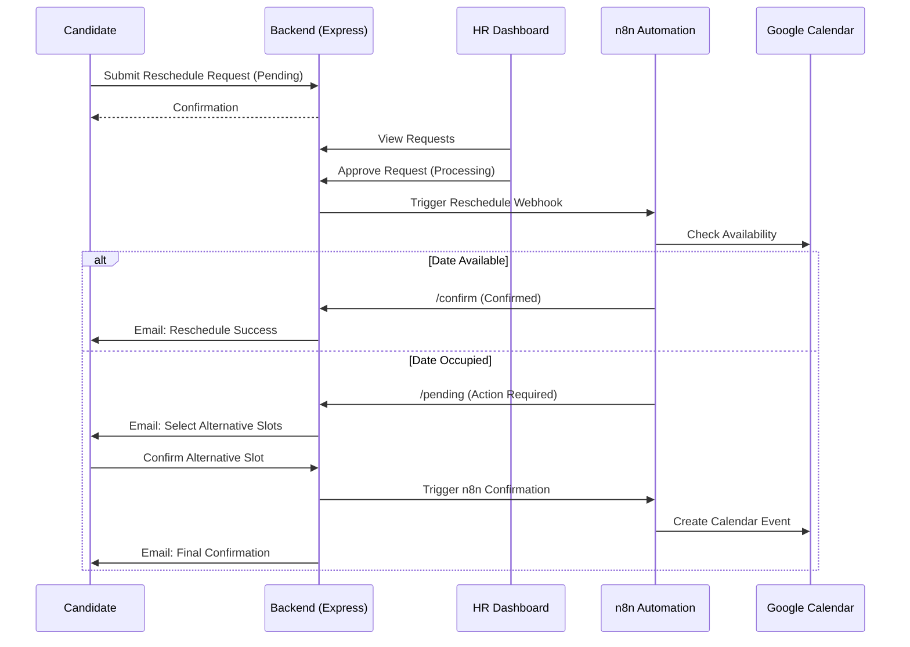

# Interview Reschedule Mechanism Analysis

This document provides a comprehensive analysis of the **Interview Reschedule** functionality in the HireAI project. It details the workflow, analyzes its efficiency, and provides real-world test cases to ensure its reliability.

---

## 1. Architectural Overview

The reschedule system is a multi-step workflow involving the **Candidate**, **HR**, and **n8n Automation**. It is designed to handle scheduling conflicts asynchronously, ensuring that calendar availability is checked without blocking user interactions.

### Workflow Diagram

---

## 2. Logic Breakdown

### Phase 1: Initiation (Candidate)
*   **Action**: Candidate submits a `POST /api/reschedule/request`.
*   **Validation**: Backend checks:
    *   Datetime is in the future.
    *   No existing active (`Pending`, `Processing`, `Action Required`) request exists for this interview.
*   **Outcome**: A `RescheduleRequest` is created in `Pending` state. The `Interview` status is set to `Rescheduled`.

### Phase 2: Review (HR)
*   **Dashboard**: HR reviews the list of pending requests.
*   **Approval**: When approved, the status moves to `Processing` and the backend fires a webhook to n8n with interview and candidate details.
*   **Rejection**: If rejected, the status moves to `Rejected`, the interview status reverts to `Active` (original date), and a rejection email is sent via Nodemailer.

### Phase 3: Automation (n8n & Calendar)
*   **Availability**: n8n checks the recruiter's calendar.
*   **Case A (Success)**: n8n confirms the time and calls `/api/reschedule/confirm`. The request status becomes `Confirmed`.
*   **Case B (Collision)**: n8n finds the slot busy, extracts alternate available slots, and calls `/api/reschedule/pending`. The request status becomes `Action Required`.

### Phase 4: Resolution (Agreement)
*   If `Action Required`, the candidate picks an alternative slot from the portal (`POST /api/reschedule/:id/candidate-confirm`).
*   The system then triggers a final n8n webhook to create the calendar event and notifies the candidate.

---

## 3. Real-World Test Cases

### Scenario 1: The "Happy Path" (Instant Approval)
*   **Candidate Date**: Friday at 10 AM.
*   **Condition**: Recruiter is free at that time.
*   **Steps**:
    1.  Candidate submits request.
    2.  HR clicks **Approve**.
    3.  n8n confirms $\rightarrow$ Available.
*   **Final State**: Request: `Confirmed`, Interview Date: `Updated`, Emails: `Success Sent`.

### Scenario 2: The "Conflict & Resolution" Path
*   **Candidate Date**: Monday at 9 AM.
*   **Condition**: Recruiter has a meeting at 9 AM.
*   **Steps**:
    1.  HR clicks **Approve**.
    2.  n8n confirms $\rightarrow$ **Busy**.
    3.  Candidate is emailed alternatives (Monday 11 AM, Tuesday 2 PM).
    4.  Candidate selects "Tuesday 2 PM".
*   **Final State**: Request: `Confirmed`, Interview: `Updated to Tuesday`, Calendar: `Event Created`.

### Scenario 3: Duplicate Request Block
*   **Candidate Action**: Tries to submit a second reschedule request while the first one is still `Pending` or `Processing`.
*   **Steps**:
    1.  Submit first request.
    2.  Submit second request immediately.
*   **Result**: Backend returns `409 Conflict`. Prevents spam and calendar clashing.

---

## 4. Efficiency Analysis

1.  **Project Integration**: The system is tightly integrated with the `Interview` and `Candidate` models. It uses a state-machine approach that ensures data consistency across the database.
2.  **Scalability**: Offloading calendar checks to n8n ensures the main Node.js backend isn't bottle-necked by third-party API latency.
3.  **User Experience**: The use of rich HTML emails and self-service alternative selection makes the process feel premium and professional.
4.  **Resilience**: The backend handles n8n failures gracefully (fallback to manual approval if the webhook fails).

---

## 5. Technical Stack

*   **Database**: MongoDB (State persistence).
*   **Logic**: Express Controllers (Status management).
*   **Email**: Nodemailer + Gmail (Direct notification).
*   **Orchestration**: n8n Webhooks (Calendar integration).
